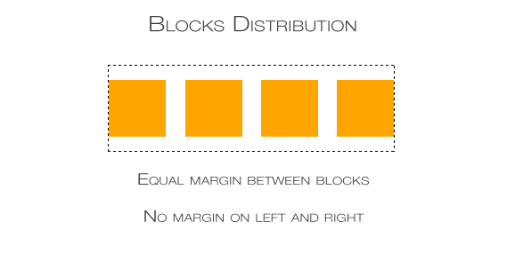

While working on a layout with grids, a certain problem may arise. Let's say we want to put some block elements equally in a line, with margins between them but without left margin of the first and right margin of the last element. The picture below illustrates what we want to achieve.

<figure>
  
  <figcaption>Equal distribution of divs qithout margin on external blocks.</figcaption>
</figure>

You can do this by setting class names or ids on elements and then give the first and the last appropriate margins values but it's not the coolest and cleanest solution. Instead let's use something more interesting.

Our basic HTML will be like that:

```html
<div id="container">
  <div></div>
  <div></div>
  <div></div>
  <div></div>
</div>
```

It's just a simple container div with four divs that we want to position inside. We don't need to give them any `class` or `id`. Also this solution applies to other block and block-ish elements, such as images.

Now let's write some CSS.

```css
#container {
  text-align: justify;
}
#container > div {
  width: 100px; /* Declare your value. Can be in relative units. */
  display: inline-block;
  vertical-align: top;

  /* IE fix. */
  *display: inline;
  zoom: 1;
}
#container:after {
  content: "";
  width: 100%;
  display: inline-block;
}
```

We set the container's `text-align` to `justify` and the inside divs' `display` to `inline-block` so they'll behave like inline elements and can be justified. The `vertical-align: top` is there to make sure that if one of those divs will be higher than other, all divs will be aligned to the top and not—as it is in default— to the bottom of the #container.

Now the layout will work only with the `:after` pseudo element. It is required because of the justification specification: the last line in paragraphs is not justified. In our case that last line would be the line with the divs. So we need to create a fake last line with `:after` pseudo element so the previous one (with divs) will get justified. You could also use an additional element (eg. `span`) but it will result in a code redundancy

And with that we have a rather fluid layout (fluid margins), that doesn't require too much syntax and the border divs are aligned to the left and right without unnecessary margin. The only headache will be to make it totally responsive on smaller devices. You'll probably need to change the divs' `display` to the default state and float them, so only two or one of them will stay in the line. For that you will either need to use `:nth-child` in the CSS or set classes for the divs.
