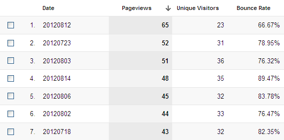
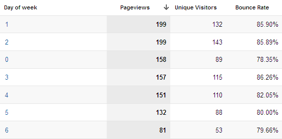

I had this practical problem in Google Analytics — I wanted to get a nice table showing me the pageviews, unique visitors, bounces rates and other statistical data broken down by days (both day of the week and a date). Standard GA functionality lets us only see the aggregated data from a time range or compare two individual ranges. Of course we could check all dates by changing the time range to the individual date but it's not really an optimal solution.

**The solution to the problem lays in the Custom Reporting functionality.** The Custom Reporting can be accessed by the top bar in the Google Analytics interface. Let's create a custom report that will show us the required data.

## Custom Report with individual dates

<figure>
  
  <figcaption>Individual dates in Google Analytics report.</figcaption>
</figure>

In the Custom Report section there's a button ”+ New Custom Report”. It lets us create a report with only the values we want, so let's create one.

Most of the functionality in there is irrelevant for us now. You can call your report however you want (the Title option), name your report tab, set some filters and so on. Let's just focus on what matters the most.

**First – choose the metrics you want to include in your report.** You do it by the “+ new metric” option in the Metric Groups part of the report. Chose whatever you want: pageviews, unique visitors, bounces rates, traffic sources, conversions. The list is quite long. You can use up to 10 metrics in one metric group. If you need more, just create another group.

The second step is the key. **In the Dimension Drilldowns section click the “+ add new dimension” and choose the Date** (you can filter it out by using the search field). Now save your report and we're done. Whenever you'll want to find out the individual data values broken down by dates, just refer to the report you've created.

## Report showing data broken down into days of week

<figure>
  
  <figcaption>Data broken down by day of week.</figcaption>
</figure>

Let's say you have an e-commerce platform, and you have higher traffic at Wednesdays and Saturdays. Surely you would like to find out more about this traffic. Once again, the standard Analytics functionality can't help. So let's refer to the Custom Reports.

Same as before, create a custom report and choose metrics you want to analyse. **In the Dimension Drilldowns add the “Day of Week” dimension.** This will generate a report with data aggregated by the day of week. You can now compare the traffic on individual day of week and get some valuable insights. But let's be even smarter.

## Compare all days of the week in some range of time

This is a combination of the previous examples, and an enhancement to the “Day of Week” report. **We want to compare — let's say — all Sundays in a month.** To do that, edit the previous report (the “Day of Week” report). In the Dimension Drilldowns section add another dimension: Date, and save the report. Now you can find that in the report the previously unclicable days of week became clickable links. Trying them out you will get a filtered list of all chosen days of week in a given range of time.

Those two (three) reports can be very useful, and they certainly will bring interesting insights. This is not the most advanced Analytics functionality, though. There are even more valuable tools that can help you make your website more awesome. I'll be sure to post some more interesting stuff about GA in the future.
