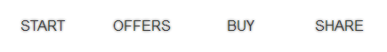
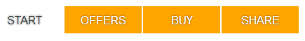

:link, :visited, :hover and :active pseudo classes are probably one of the first things everyone learn when learning HTML. For now let's focus on :visited. The purpose of this pseudo class is to indicate if the website behind the link (anchor) was previously visited and if it was, then it applies some style to the anchor according to rules declared in CSS. Most often you can see them on Wikipedia and Google. The visited links change their colour from blue to violet. It's a useful technique. It helps visitors distinguish between the content they read and let them focus on the new one. So let's find out how it can also improve a click rate of some links.

Imagine we have some of the following case:

*   a new link in navigation container we want to distinguish somehow from other links in this container,
*   a tabbed navigation that has some important information in every tab and we want to encourage people to click through them,
*   a products list with some products that are not so popular like other and we want to get people to read about them.

At the end you will probably find some other useful application of the method described in this post, so for now…

## Let's increase click ratio with :visited

The whole idea behind this method is to style links so they will stand out of the crowd and then, if they were clicked, apply the basic style of the links using :visited. Our basic case will be those four links below with default styling.

<figure>
  
  <figcaption>Links with basic style applied. Only white background. No eye-candies.</figcaption>
</figure>

The CSS for this is:

```css
a {
  display: block;
  float: left;
  width: 90px;
  padding: 10px;
  margin: 10px 1px;
  font-family: Helvetica, Arial, sans-serif;
  text-decoration: none;
  text-align: center;
  text-transform: uppercase;
  text-shadow: 0 0 2px #424242;

  /* The important part. */
  background-color: #fff;
  color: #424242;
}
```

For now those are just normal links with the basic style. The names I used are meant to be similar to a landing page where we want to sell something. The Start is for a home/landing page. It will be important later.

Now we will be trying to encourage visitors to click through all of the menu items. In the code above you can see "the important part". It is the default styling we want for links on the page and it will be applied after someone click on the menu item. So lets move that part to the :visited pseudo class.

```css
a:visited {
  background-color: #fff;
  color: #424242;
}
```

Now only the visited state is styled as we want, so the links that were not visited yet will become blue in our example. That is the place were we create our bait. We will style those links so they will stand out.

```css
a {
  /* Here go the basic properties: display, float and so on.*/

  /* Our bait. */
  background-color: orange;
  color: #fff;
}
```

The links that were not visited will become orange with white text colour. If a visitor goes to the linked page, link will then become white with #424242 text colour, as we declared it in :visited pseudo class. The effect we got looks like that:

<figure>
  
  <figcaption>Not visited links are now orange so they stand out and catch attention.</figcaption>
</figure>

We have created a menu with links that ask for attention and stand out of the rest if they were not visited. Only after clicking that link it will change to the default styling. As you can see, the Start link is already in that state. As I mentioned before, the Start link links to the landing page so it is only obvious that it was already visited right in the moment a visitor came to the website. The purpose here is to make the rest three links stand out a bit more because the Star link is kinda pale.

The final CSS:

```css
a {
  display: block;
  float: left;
  width: 90px;
  padding: 10px;
  margin: 10px 1px;
  text-decoration: none;
  text-align: center;
  text-transform: uppercase;
  font-family: Helvetica, Arial, sans-serif;
  text-shadow: 0 0 2px #424242;
  background-color: orange;
  color: #fff;
}
a:visited {
  background-color: #fff;
  color: #424242;
}
```

This trick will work with many cases in many places of your website. You don't need any JavaScript – just a simple CSS. This brings some interaction with the website and also brings back the website's basic aesthetics after the action was taken by the user. I wonder if it isn't some kind of [gamification](http://en.wikipedia.org/wiki/Gamification) since user might want to click them all to get the "prize" which will be the different state of links.

Anyway, before you will start thinking of awesome ideas how to style this link bait, keep in mind you can only use the following properties when dealing with :visited pseudo class due to [some security issues](https://developer.mozilla.org/en/CSS/Privacy_and_the_%3Avisited_selector):

*   color,
*   background-color,
*   border-color (and its sub-properties),
*   outline-color,
*   the color parts of the fill and stroke properties.

This method can be also useful in web applications or forms where there's a path from one point to another. After "clearing" the point, user goes to another and the previous gets another style.

I hope it will help you increasing click rate of your links an you will find this trick useful.
