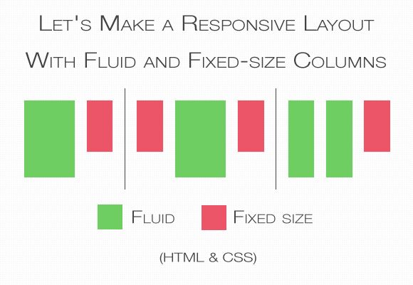

CSS is not at its best when it comes to creating a layout. The [flexible box model](http://www.html5rocks.com/en/tutorials/flexbox/quick/) that is intended for this purpose is not yet ready to use due to the lack of support from Internet Explorer, so designers usually have to use floats or set an element's display property to inline-block to achieve effects they want. This CSS's inability is even more bothersome when you want to make your website responsive.

In this post I'll focus on a specific problem — that is how to write styles when you want to have a fluid content box together with a fixed-size content box that are next to each other and they're taking the same horizontal space.

<figure>
  
  <figcaption>Let's make a responsive layout with fluid and fixed content with HTML and CSS</figcaption>
</figure>

## Challenge

Vertical space is always limited by the size of the user's screen or browser's window and only has a fixed amount of pixels (100% in relative units) available to use. This amount changes depending on the screen/window size. That's why the fixed-size boxes will always take different relative space expressed in %. And here is the problem. You need to declare a width of a fluid-box in percentage, but you can't know how many percent will be taken by fixed-size boxes. Whatever you will write, either the fluid-box will overlap with the fixed-one, or a space between them will be too big. That's why tricks are necessary to make your website beautiful.

As a solution I'll use two methods. The first one is to use negative-margins on floated elements. It is less intuitive, requires more rules in CSS and additional wrapper in HTML, but is supported in all browsers and, in some cases, more flexible. The second one is to use the [table-cell](http://www.w3.org/TR/CSS2/tables.html#value-def-table-cell) value of the display property. This method is easier, require less CSS rules and HTML syntax and gives additional value: vertical alignment and the same height of all elements in a row but is not supported by IE7-. Which method will you use is up to you and your needs.

## Fluid and fixed-size content — solution

I'll use the classic layout: big content-box with a small, fixed-size sidebar on the right. Any other variations such as two fluid boxes with one fixed box, two fixed boxes with one fluid in the middle, can be easily made from this basic one.

The syntax for the negative-margin solution and the table-cell solution will differ slightly. With the negative-margin we need additional block element (in this example the `div` with `id=inner-block`) that is not necessary when working with table-cells.

```html
<div id=fluid>
  <div id=inner-block> 
    <!-- Content goes here. --> 
  </div>
</div>
<div id=fixed-width>
  <!-- Content goes here. -->
</div>
```

Inside those block you can put almost any other content: text, another block, list, images and so on. In the inner-block you can even put another flexible blocks (_yo dawg!_) to make a layout with more than one flexible column.

## Negative margin solution

The CSS for the negative-margin solution goes like that:

```css
#fluid {
  float: left;
  width: 100%;
  margin-right: -250px; /* The size of the fixed block. */
}
#inner-block {
  margin-right: 250px; /* The size of the fixed block. */
}
#fixed-width {
  float: left;
  width: 250px; /* The size of the fixed block. */
}
```

There are some points that require explanation.

I assumed the fixed-width block will be 250px big. You have to change that value to suit your needs but pay attention that #fluid block has a negative margin. Also you might want to add some space between those blocks. The easiest way to do this is to increase the #inner-block's margin by the value of margin you want to have between the #fixed-width and #fluid blocks.

If you're wondering what's really happening there, it's simple. The container #fluid box and the sidebar #fixed-width are both floated, so in normal circumstances, they'll be positioned next to each other in vertical space. But since floated block elements take as much space as their content require, there's not enough horizontal space for other floated elements in a browser's window — #fluid takes it all. That's why we need to declare two rules. First we need to pull the sidebar into the content area using negative value in margin-right property. But it's not enough. Right now browsers will just increase the size of our floated box by the negative margin. That's why the rule `width: 100%` is required to keep the #fluid's size in the window or — in other cases — inside of the #fluid's container element.

Now the only issue is that the content of both elements overlap. Hence the #inner-block that has the margin big enough to separate both elements' content.

## Table-cell solution

This one is simpler, more intuitive but is not supported by IE7-. We also don't need the #inner-block element. The CSS:

```css
#fluid {
  display: table-cell;
}
#fixed-width {
  display: table-cell;
  width: 250px;
}
```

And that's (almost) all. Just three rules. What we did is just to change the elements display behaviour to that of cells in a table. Cells that don't have declared width will automatically take remaining space, which means they'll be responsive. The only issue that may arise when using this method is that it might not work unless you set the display property of the container, that is a parent of both #fluid and #fixed-width, into table (`display: table`). The `<body>` is also that kind of a container, so you can also make it display as table.

## Other layouts

The example I used is a good base for other types of layouts. If you want to have two fluid content boxes just put two block elements inside of #inner-block or directly into #fluid (depending on which method you use) and set their widths in relative units (%) without any haxes. In case you would like to have two fixed size boxes and fluid box in the middle, just put the left fixed box before the #fluid `div` in your HTML, make it `float: left`, set its width, add negative left margin to #fluid and left margin to #inner-block.

So what are you waiting for? Make your website beautifuly responsive! ♥
