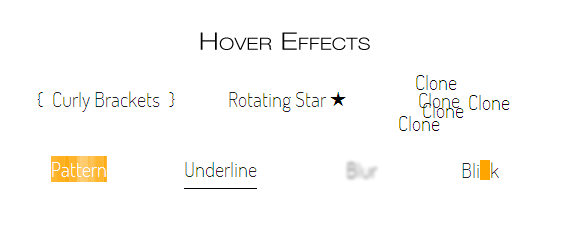

<figure>
  
  <figcaption>Unique hover effects.</figcaption>
</figure>

The hover effect gives user a feedback when he or she moves a mouse cursor over a link. It's one of the most important effect on websites and greatly increase a user experience. Usually it's done by changing basic properties of links: `color`, `background-color`, `border` (especially `border-bottom`) or `text-decoration`. Let's try something more unique.

## The basic code

We will use just a basic HTML for link. Nothing else is required in the code.

```html
<a href="#" class="class">Anchor text</a></pre>
```

As for the CSS, there will be some universal rules relevant to all exemplary classes, so to not repeat ourselves, I'll write it only here.

```css
a {
  text-decoration: none;
  position: relative;
  transition: all .3s; /* Vendor prefixes required in your code. */
}
a:after, a:before {
  transition: all .3s; /* Once again, vendor prefixes required. */
}
```

We don't want the default links underline, hence the rule `text-decoration: none`. In some cases we will use an absolutely positioned elements that will be relative to links, so the `position: relative` rule. And at last we want to smoothly transition all state changes with `transition` property. Also remember that I don't use vendor prefixes in the code examples to make this examples shorter. You have to include them when writing your own code. They are included in the [demo page](/demo/hover-effects) with all examples, though.

Now let's get to the actual ideas.

## Curly Brackets or Other Punctuation Elements

[Curly brackets demo](/demo/hover-effects/#brackets).

On hover, a link will be surrounded by curly brackets. The effect is quite elegant. You can easily implement it in navigations, links lists or any other places where anchors will have enough space on the left and right sides. On the other hand, it doesn't look so good when used in text unless you increase the `word-spacing` so the brackets won't appear on neighbour words. You can also decrease the `left` and `right` value of both pseudo elements, but it won't look as good, as it does when anchor is alone.

The CSS for this is:

```css
.brackets:before, .brackets:after {
  position: absolute;
  top: -9px; /* Value depends on your design. */
  color: transparent;/* It makes the curly brackets invisible at the beginning.*/
}
.brackets:hover:before, .brackets:hover:after {
  color: black; /* Or whatever colour you want. */
}

/* For movement */
.brackets:before {
  content: "{";
  left: -20px;
}
.brackets:hover:before {
  left: -15px;
}
.brackets:after {
  content: "}";
  right: -20px;
}
.brackets:hover:after {
  right: -15px;
}
```

If you don't want curly brackets to move you can simply declare the `content` values without the `left` and `right` properties. You won't even need the absolute positioning.

## Rotating Star

[Rotating star demo](/demo/hover-effects/#rotating-star).

It is a quite interesting effect that might looks really nice in some circumstances. The idea behind is similar to the previous example but now we'll use only one pseudo element. After a user hovers over the element, the rotating star will pop out. For rotation I obviously use the `transform` property together with the `transition` property (you might be interested in some thoughts on [future-friendliness of combining transitions with transforms](/transition-with-transform-cant-be-future-proof)).

Of course star shape is just my personal preference. Some other characters might also look nice. Refer to the [list of Unicode characters](http://en.wikipedia.org/wiki/List_of_Unicode_characters) for ideas.

```css
.rotating-star:after {
  content: "\2605";
  position: absolute;
  top: -4px;
  right: 0;
  color: transparent;
}
.rotating-star:hover:after {
  right: -25px;
  color: black;
  transform: rotate(360deg); /* Vendor prefixes. */
  /* A small fix. Read below why it's needed. */
  padding: 5px;
}
```

The only thing that might seems to be unclear is the `padding` property. It is required because the pseudo element, when positioned to the right from the link, create small space between those two and when user will move his or her cursor in that space, transition will start jumping. The padding fill that hole so the bug won't appear.

The Rotating Star method is meant to be used only when links are alone (navigation etc.) and there's nothing to the right from the link. If put in content, the pseudo element will cover the text.

## Underline

Underline is a default style of links in all browsers. Let's redesign it so it will look nice. See the [underline demo](/demo/hover-effects/#underline).

On hover, a link will become underlined. But we won't use the `text-decoration` property since we can't do much styling with that. Instead we will use once again a pseudo element. With cursor hovering on the link, the line (pseudo element) will be gently transitioned from left creating a pleasing effect.

```css
.underline {
  overflow: hidden;
  display: inline-block;
  margin-bottom: -14px; /* Value depends on your design. Fix the awkward space from overflow:hidden. */
}
.underline:before {
  content: "";
  position: absolute;
  left: -100%;
  bottom: 0;
  display: block;
  width: 100%;
  height: 1px;
  background-color: black;
}
.underline:hover:before {
  left: 0;
}
```

The `:before` pseudo element serves as a line. It's just a simple styling, not worth commenting. What's important is the basic element. The key part is `overflow: hidden` rule. It hides the line that is positioned to the left from the element before hovering. After hover, the line moves to the right creating the effect. The `display: inline-block` rule is necessary because only block and blockish elements can have the overflow property set. For navigation you can set the `display: block`. In this example though, it is `inline-block` so it fit nicely in a normal text content. Hence it is the first example that can be used with that purpose.

## Clone

[Clone demo](/demo/hover-effects/#clone)

It's a simple yet interesting effect. We use the `text-shadow` to copy an anchor text and create some clones.

```css
.clone:hover {
  text-shadow: 4px 10px black, -20px 23px black,
               -3px -18px black, 50px 2px black;
}
```

Multiple shadows create interesting effect multiplying an anchor's text. It might look good when the element has some space around, so the shadows won't blend with their surrounding. On the other hand it doesn't look that bad when used in normal content. You might even add some shadows to the shadows by adding clones of this clones but with a blur set (as a third numerical value of a shadow).

## Pattern

[Pattern demo](/demo/hover-effects/#pattern)

Not much to say. Just a simple idea of using CSS generated patterns instead of solid background colour or image. Browse the [pattern gallery](http://lea.verou.me/css3patterns/) and find something nice for your design.

```css
.pattern:hover {
  color: #fff;
  background-color: #ffa500;
  background-image: /* Prefixes required in a real code. Included in the demo. */
    linear-gradient(0, rgba(255,255,255,.07) 50%, transparent 50%),
    linear-gradient(0, rgba(255,255,255,.13) 50%, transparent 50%),
    linear-gradient(0, transparent 50%, rgba(255,255,255,.17) 50%),
    linear-gradient(0, transparent 50%, rgba(255,255,255,.19) 50%);
  background-size: 13px, 29px, 37px, 53px;
}
```

As a side note, if you want to use this pattern, just copy the code from the demo's source and change only the `background-color` for the one you want.

## Blur

[Demo of the blur effect](/demo/hover-effects/#blur).

It's a simple effect of blurring an anchor's text. We don't need any magical CSS properties or SVGs. Just a `text-shadow`. This is an interesting, yet not usually practical effect, since it makes the text unreadable. You should use it with consideration.

```css
.blur:hover {
  color: transparent;
  text-shadow: 0 0 3px black;
}
```

## Orange moving box

[Red moving box demo](/demo/hover-effects/#blink).

When user hovers over a link, an orange box will blink. I don't find it too appealing, but the mechanism behind can be used to create some more interesting effects.

```css
.blink {
  display: inline-block;
  overflow: hidden;
  margin-bottom: -14px; /* Value depends on your design. Fix the awkward space from overflow:hidden. */
}
.blink:before {
  content: "";
  position: absolute;
  top: 10px;
  left: 0;
  display: block;
  height: 20px;
  width: 10px;
  transition: left .3s; /* Prefixes. */
}
.blink:hover:before {
  background-color: #ffa500; /* Orange */
  left: 100%;
}
```

We use the same rules as with the underline effect when it comes to the `.blink` class. It is required for the pseudo element to hide after the transition is done. It would stay on the right otherwise. As you can see, we use unique value of transition for this example. We don't want any animation of `background-color`. Just its position.

Blink effect can be used together in navigation and other blockish elements of a website and inside of a content, since it doesn't affect surrounding text. In the example I used an orange (#ffa500) rectangle, but it's easy to change its shape and colour or even to use an entity character as it was done in the rotating star example.

## More to achieve

There are many more original `:hover` effects to achieve. You might be interested in trying the CSS animations for endless possibilities. Or so I would say, but all this hovering state last quite short. Users won't be willing to stop their browsing and wait until the animation is finished. They just want to know if the link is click-able, and then they carry on. That's why I focused only on those simple and quick effects, and I advise you to do the same.
